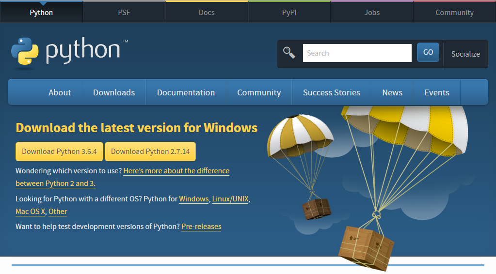
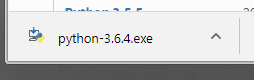
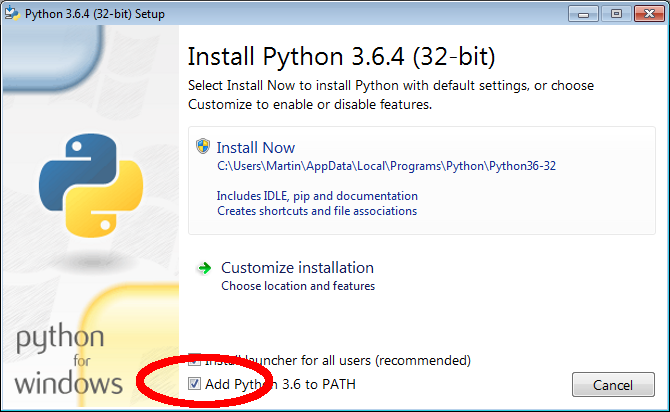
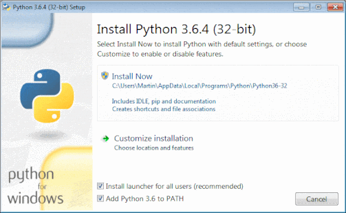
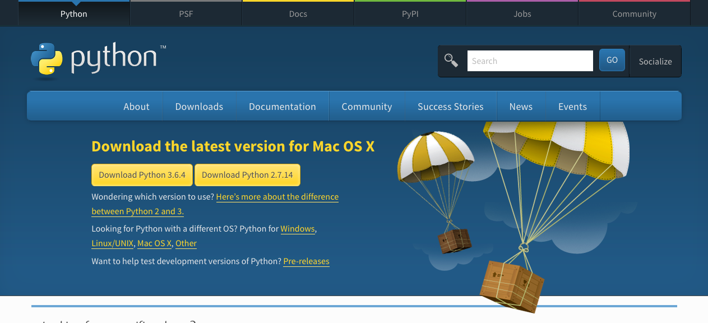
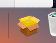
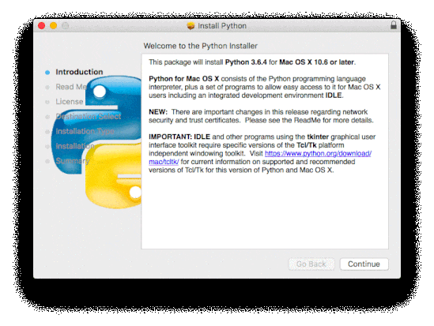

यदि Python 3 या IDLE आपके कंप्यूटर पर इंस्टॉल नहीं है, तो अपने ऑपरेटिंग सिस्टम के लिए नीचे दिए गए इंस्टॉलेशन निर्देशों का पालन करें:

+ [Microsoft Windows](#windows)
+ [macOS](#macos)
+ [Raspberry Pi OS and Linux](#linux)

## <a name="windows"></a> Microsoft Windows

यह अनुशंसा की जाती है कि आप [Microsoft Store के माध्यम से Python इंस्टॉल करें](#windowsappstore)। यदि यह संभव नहीं है, तो आप [Python इंस्टॉलर का उपयोग](#windowspythoninstall) भी कर सकते हैं [www.python.org](https://www.python.org) से।

### <a name="windowsappstore"></a>Microsoft Store (अनुशंसित)

+ [Microsoft Store में Python 3.8 एप्लिकेशन](ms-windows-store://pdp/?ProductId=9MSSZTT1N39L) खोलें।

+ **Get** बटन पर क्लिक करें Python 3.8 को डाउनलोड और इंस्टॉल करने के लिए।


+ Python 3.8 डाउनलोड और इंस्टॉल किया जाएगा। नोटिफिकेशन बार (अधिसूचना पट्टी) में प्रगति दिखाई जाएगी।


+ जब इंस्टॉलेशन प्रक्रिया पूरी हो जाती है, तो एक अधिसूचना दिखाई देगी।


### <a name="windowspythoninstall"></a>Python इंस्टॉलर

+ अपना वेब ब्राउज़र खोलें और [www.python.org/downloads](https://www.python.org/downloads){:target="_blank"} पर जाएँ।

+ इस वेब पृष्ठ पर, आपको Python 3 के नवीनतम संस्करण को इंस्टॉल करने के लिए एक बटन दिखाई देगा। बटन पर क्लिक करें, और एक डाउनलोड स्वचालित रूप से शुरू हो जाएगा।



+ `.exe` फ़ाइल पर क्लिक करें इसे चलाने के लिए (यह आपके `Downloads` फ़ोल्डर में सहेजा गया होगा, या जहाँ भी आपका कंप्यूटर डिफ़ॉल्ट रूप से डाउनलोड की गई फ़ाइलों को सहेजता है।)



+ खुलने वाले डायलॉग बॉक्स में, पहले **Add Python 3 to PATH** के आगे बॉक्स में टिक करना महत्वपूर्ण है।



+ **Install Now** पर क्लिक करें और इंस्टॉलेशन गाइड का पालन करें। सेटअप प्रक्रिया में थोड़ा समय लगेगा।



+ एक बार सेटअप पूरा हो जाने पर, **Done** पर​ क्लिक करें और फिर अपना वेब ब्राउज़र बंद करें। अब आप स्टार्ट मेन्यू पर जा सकते हैं IDLE खोलने के लिए।

## <a name="macos"></a> macOS

+ अपना वेब ब्राउज़र खोलें और [www.python.org/downloads](https://www.python.org/downloads){:target="_blank"} पर जाएँ।

+ इस वेब पृष्ठ पर, आपको Python 3 के नवीनतम संस्करण को इंस्टॉल करने के लिए एक बटन दिखाई देगा। बटन पर क्लिक करें, और एक डाउनलोड स्वचालित रूप से शुरू हो जाएगा।



+ इंस्टॉलेशन प्रक्रिया शुरू करने के लिए डॉक में डाउनलोड पर क्लिक करें।



+ **Continue** पर क्लिक करें और इंस्टॉलेशन गाइड का पालन करें। इंस्टॉलेशन में थोड़ा समय लग सकता है।



+ जब इंस्टॉलेशन प्रक्रिया पूरी हो जाए, तो **Close** पर क्लिक करें।

+ अपने एप्लिकेशन से IDLE खोलें।

## <a name="linux"></a> Raspberry Pi OS और अन्य Linux (Debian-based) distributions

Most distributions of Linux come with Python 3 already installed, but they might not have IDLE, the default IDE (interactive development environment), installed.

`apt` का उपयोग करें यह जाँचने के लिए कि क्या वे इंस्टॉल्ड हैं और यदि वे नहीं हैं तो उन्हें इंस्टॉल करें।

+ Open a terminal window and type:

```
sudo apt update
sudo apt install python3 idle3
```

This will install Python 3 (and IDLE), and you should then be able to find it in your Application menu.
